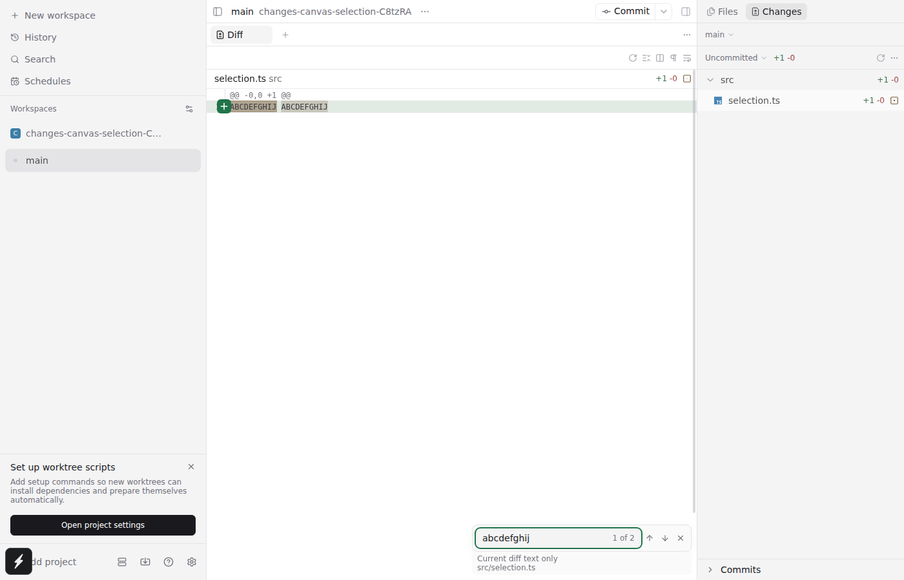
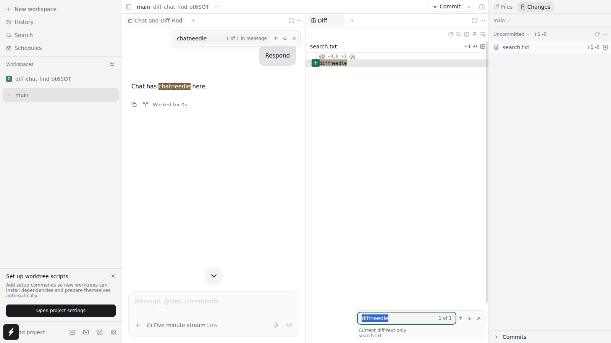
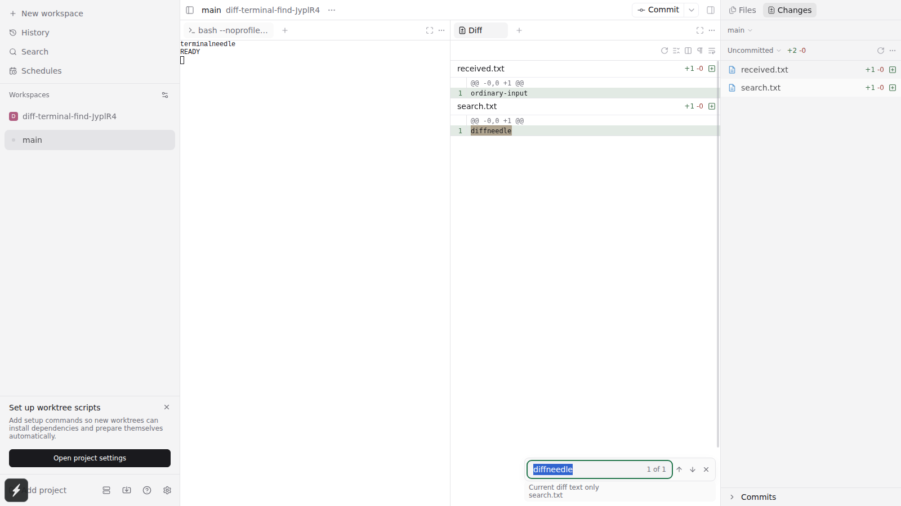

# Diff Find on current main

Feature commit: `7ba666dc6686228538881996b1fdd1c3ce1ecb35`.
Test-readability follow-up / current head: `81a07ed7370e495534850493a98f384eb393b8cd`.
Base: `bb4763b38cb6d8e26b0eca54088fb14ce899ec68`.

The 16-scenario verification was completed on `047f40e6`. Main then added only the chat Find capture-phase fix (#4991). After rebasing, full-workspace format/lint/typecheck and all 97 targeted unit tests passed again; the Diff highlight and chat/terminal coexistence cases also passed, with normal chat activation and no explicit content-focus workaround.

This is the shared PaneFind implementation rebased onto main after #4589, #4650 and #4765 merged. The old replay stack and local test-runner configuration are not included.

## Review follow-up: readable E2E journeys

The eight Diff Find test bodies now contain 6–8 user-level statements. Common Find actions and neighboring-pane interactions live in `e2e/support/helpers/diff-find.ts`; existing canvas paint sampling and mouse-drag primitives are shared through `diff-source.ts`. Scenario setup stays in the owning spec and preserves its existing real-daemon/repository cleanup. No production files changed.

Highlighting/clearing and selection preservation were split into separate scenarios; all original behavior assertions remain. Thirteen focused real-browser cases passed, including the eight Find journeys and five existing selection/review cases using the extracted primitives. The terminal case passed again after restoring its initial-query independence assertion in the helper. All-workspace format/lint/typecheck passed. Tests still run under the same 3GiB hard cap; no cgroup OOM kills.

- [13-case browser regression output](review-followup-browser.txt)
- [Final static checks and terminal regression output](review-followup-final.txt)

## Verified

- All-workspace typecheck and lint passed; formatting checked on the restored, publishable tree.
- 97 tests passed in seven targeted files: Diff Find model, diff document geometry, hit testing, range geometry, web painting, native hit testing and locale resources.
- 16 real browser scenarios passed across runs: seven Diff Find flows (including file/chat/terminal coexistence), commit diff layout/Find, two original clipboard/review flows, four file Find regressions, one original chat Find flow and one original terminal Find flow.
- The final batch recorded 15 passes and a first-worker setup timeout before its scenario ran. That scenario then passed unchanged on a targeted rerun. See both logs below.

## Raw command output

Local checkout paths have been replaced with `$WORKTREE`/`$DELIVERY`, and ANSI color escapes removed for readability. Test names, results and failures are retained; these are not synthetic summaries.

- [Build, lint, typecheck, 97 unit tests](static-and-unit.txt)
- [Final 16-case browser batch, including setup timeout](browser-batch.txt)
- [Unchanged targeted rerun of the remaining scenario](browser-rerun.txt)
- [Final highlight/chat/terminal checks after #4991](final-focus-regressions.txt)

Local startup used a temporary optional harness patch for a longer Metro warmup; it was removed from the publishable branch. Functional assertions were unchanged. Cold prewarming ran separately from the browser tests. The test service had a 3GiB group hard cap; final runs recorded no cgroup OOM kills.

## Screenshots / recording

All content below comes from generated test workspaces.

### Working diff

### Independent Diff and chat Find

[Browser recording](diff-chat-find.webm)

The final test uses the normal chat pane activation/composer autofocus behavior supported by main's #4991; it does not move focus to an internal chat host.

### Independent Diff and terminal Find

## Scope and limitations

Runtime verification was Linux Chromium, including narrow browser layout. Actual Electron, macOS/Windows and native devices were not exercised. Native Find is not added. The shared native hit-testing unit tests pass.

Find searches canonical diff text already delivered to the client, not full-file context or filenames. Matching is literal, case-insensitive and single-line; only the first 10,000 occurrences are navigable. Binary/oversized files are excluded with a visible notice. No regex, replace, Viewed markers or context expansion.

A prior matching-only fixture (21.2M characters / 53,250 lines / 213 files) was rerun on the unchanged search engine during rebase validation: approximately 279ms cold including debounce, 2.7ms cached update, with a longest callback of 21ms on the constrained host. This is not a whole-renderer benchmark. The four-millisecond scheduler check is a cooperative budget, not a guarantee against individual long operations or OS descheduling.
