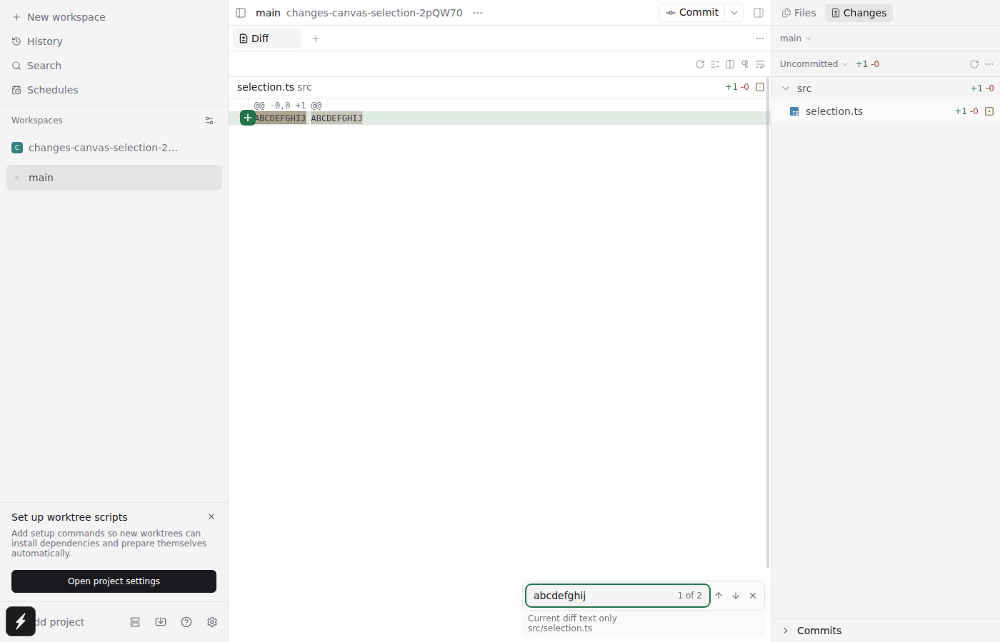
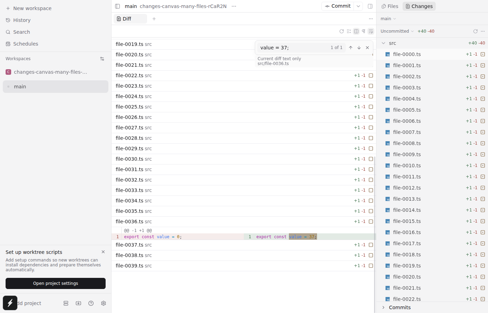
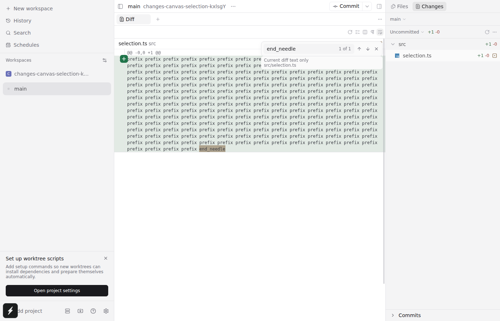

# Diff Find review evidence

These are generated test workspaces, not screenshots of user projects. The two draft implementations are alternatives.

| Variant | Feature commit | Static checks | Targeted unit tests | Real browser workflows |
|---|---|---|---|---|
| Standalone main UI | `f68cec00` | format, lint, all-workspace typecheck passed | 100 passed | 8 passed |
| Shared PaneFind from upstream PR4589 | `29b9e751` | format, lint, all-workspace typecheck passed | 100 passed | same 8 + 4 original file Find workflows passed |

Shared baseline: `0474c3e0`. The second review base replays upstream PR4589 at `db8c22e1` onto that baseline. No upstream PR was merged.

## Exercised behavior

- Added, removed and context text; collapsed/offscreen files.
- Literal matching, original UTF-16 positions, regex characters treated literally.
- Match highlighting/clearing, next/previous, closing/refocusing.
- Unified/split, wrapping and long-line horizontal reveal.
- Clipboard selection and inline-review regression flows.
- Live diff replacement/cancellation and neighboring file Find focus.
- Commit Diff including a narrow viewport.
- Shared variant: file replacement, Undo/save, large read-only source, split focus and narrow file Find.

Targeted suites are in `packages/app/src/git/diff-document/`, `packages/app/src/i18n/resources.test.ts`, and `packages/app/src/e2e-metro-readiness.test.ts`. Browser scenarios use the existing `changes-pane.spec.ts`, `commit-diff-panel.spec.ts`, and, in the shared branch, `pane-find.spec.ts` with a real isolated daemon and temporary Git repositories. The full test suite was not run.

## Screenshots

### Working diff: active/inactive literal matches

### Collapsed file revealed in side-by-side layout

### A long-line match after enabling wrapping

## Performance scope

The matching-only generated benchmark covers 21,197,098 characters, 53,250 rows and 213 files. Cold search took about 260ms including debounce, with about 86ms CPU and a longest callback of about 4ms. Cached unchanged-file update took about 1.8ms. These are not whole-renderer or physical-device guarantees.

Final shared-browser verification used a separate systemd test unit with a 3GiB group memory hard cap, single worker and recorded resource samples. Its sampled peak was about 2.88GiB, with zero OOM kills.

## Limits

Runtime verification was Linux Chromium, including narrow browser layout. Actual Electron shell, macOS/Windows, and native devices were not exercised. Native Find is not implemented. No filename filtering for Changes, regex, multiline search, replacement in Diff, or Viewed markers. At most the first 10,000 occurrences are navigable; additional matches are indicated by `10000+`.
